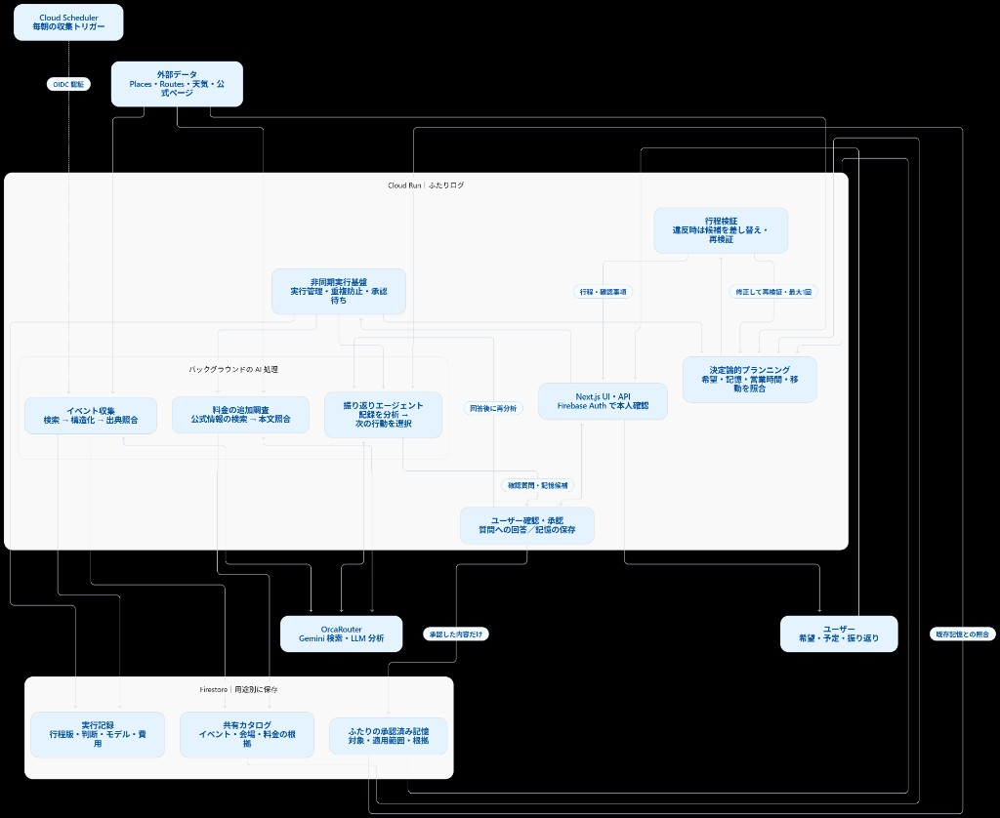
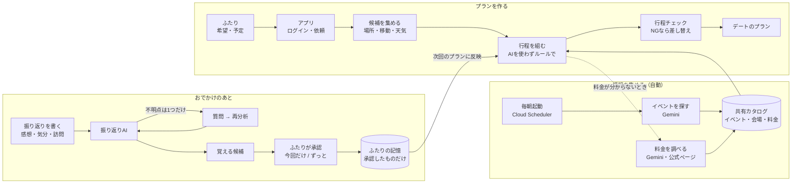

# ふたりログ

二人の希望を聞いて一日のデート案を作り、予定が崩れたら組み直し、確認した記憶を次のデートに活かす Web アプリです。計画する側の一人が使います（相手専用アカウントはありません）。

公開デモ（Cloud Run）: https://futari-log-w5a2hgpkiq-an.a.run.app  
ローカル既定は **MOCK + Firebase Auth / Firestore Emulator** です。本番は **Firebase 匿名認証** と Firestore を使います（Google ログインは未マージの進行中作業）。

## 設計方針

- **プラン生成は決定論**（候補選定・行程組み立てにチャット LLM を使わない）
- **材料集めと振り返り分析**はエージェント／非同期 run（Places・Routes・振り返り LLM など）
- **利用者が待つ初回プラン経路に LLM を置かない**（レイテンシのため。LLM 除去前後の計測は [検証レポート](docs/reports/agent-architecture-v2-20260921.md)）

詳細な仕様・設計は `docs/specs/`・`docs/design/`、担当境界は [`AGENTS.md`](AGENTS.md)。

## 検証で確かめたこと

数値はいずれも [`docs/reports/agent-architecture-v2-20260921.md`](docs/reports/agent-architecture-v2-20260921.md) の記録です。

| 内容 | 記録 |
| --- | --- |
| 初回プラン経路から同期 LLM / grounding を外した前後の所要 | 第1回 **66,148 ms** → 第2回 **17,854 ms**（`createdAt`→`finishedAt`）。差分表は[同レポート「第1回との差分」](docs/reports/agent-architecture-v2-20260921.md) |
| 振り返り → 記憶（`planDirectives`）→ 次プラン、記憶あり／なしの切り分け | 第3回。ローカル `buildPlan` が LIVE と一致したうえで、記憶なし比較で滞在差を確認（[同レポート「第3回」](docs/reports/agent-architecture-v2-20260921.md)） |
| 祝日の営業判定（`currentOpeningHours` の日付照合）と東京の複数エリア | 敬老の日（2026-09-21）。MOT など dated=OPEN / regular=CLOSED の例、エリア表（東京駅・渋谷・新宿・浅草・吉祥寺・下北沢・清澄白河）は[同レポート「32973b1 … 多エリア確認」](docs/reports/agent-architecture-v2-20260921.md) |
| `NEXT_DATE` の束縛 | 第3回で承認記憶が新セッションへ束縛されたこと（[同レポート「NEXT_DATE 束縛」](docs/reports/agent-architecture-v2-20260921.md)） |

カレンダー UI の LIVE 通し（東京→新宿 WALK）は [`docs/reports/live-verify-20260920.md`](docs/reports/live-verify-20260920.md)。阻害要因の一覧は [`docs/blockers.md`](docs/blockers.md)。

## 画面の流れ（現状）

1. **`/auth`** — ゲスト（匿名）／ログイン／新規作成
2. **ホーム** — カレンダー、提案カード、近くのイベント（表示用サンプル）。日付を選んで気分シールを貼り、端末の写真を切り抜いて思い出シールとして並べる（クリックでその日の振り返りをすぐ見られる）
3. **`/plans/new`** — 3ステップ（過ごし方 → 日時・場所 → 予算・確認）でセッション作成し、初回プラン run を起動
4. **セッション** — 行程・確認質問・再計画・振り返り保存
5. **記憶** — 候補の明示承認後にだけ次プランへ効く

UI だけ触る場合は [`docs/ui-handoff.md`](docs/ui-handoff.md) と `npm run dev:ui`。

## アーキテクチャ

審査・説明用の全体像。詳細な実行経路は [`docs/workflows.md`](docs/workflows.md) / [`docs/cloud-run.md`](docs/cloud-run.md)。LLM のルーター対応は [`docs/specs/llm-routing.md`](docs/specs/llm-routing.md)。





Cloud Run では `PLAN_ORCHESTRATOR=workflows`。ローカルは worker。

**写真シール**は上図のサーバ経路の外で動く。ブラウザ内で U2NetP（ONNX）により切り抜き、最大4枚を `localStorage` にだけ残す（振り返り本文のサーバ保存や Firestore の承認済み記憶には載せない）。実装は [`src/features/home/photo-sticker.tsx`](src/features/home/photo-sticker.tsx) / [`src/client/hooks/use-date-journal.ts`](src/client/hooks/use-date-journal.ts)。

## 堅牢性のための仕組み

| 仕組み | 場所 |
| --- | --- |
| 非同期 run の lease・期限切れ INTERRUPTED、セッションあたりの同時 run 制限、冪等キー | [`src/server/agent/lease.ts`](src/server/agent/lease.ts)、[`src/server/repositories/store.ts`](src/server/repositories/store.ts)（`insertPendingRun`） |
| LLM 失敗の種類分け（JSON / schema）・NOTICE 観測・1回の repair | [`src/server/llm/index.ts`](src/server/llm/index.ts) |
| 呼び出し側 signal とタイムアウトの合成（`AbortSignal.any`） | [`src/lib/abort.ts`](src/lib/abort.ts) |
| 解析失敗イベントに振り返り本文・LLM 本文プレビューを載せない | [`src/server/llm/index.ts`](src/server/llm/index.ts)（`LlmParseFailureEventPayload`） |
| CI（typecheck / boundaries / MOCK 単体 / Eval harness） | [`.github/workflows/ci.yml`](.github/workflows/ci.yml) |

## 改善の測り方

計画経路の回帰は **Eval harness**（`npm run eval`）で測る。`APP_RUNTIME=MOCK` + 一時 `STORE_DIR` で `evals/scenarios/*.json` を回し、合否と `plan_success` / `api_calls` / `latency_ms` などを `evals/out/latest.json` に出す。詳細は [`evals/README.md`](evals/README.md) と信頼性ロードマップ（[`docs/specs/reliability-roadmap.md`](docs/specs/reliability-roadmap.md)）。

## 既知の制約

- **directive で表せない好み**（特定の食べ物など）は、型付き `planDirectives` が無い限りプラン選定に載らない
- **ホームの提案カード**は UI 定数（LLM 生成ではない）。[`src/features/home/home-suggestion.ts`](src/features/home/home-suggestion.ts)
- **ホームの「近くのイベント」**は大会用サンプル表示。カタログ ID には載せない。[`src/features/home/sample-events.ts`](src/features/home/sample-events.ts)
- **写真シール**は端末内のみ（最大4枚・サーバ未送信）。機種変更や別ブラウザでは消える
- **会場・日付**: LIVE / Cloud Run の検索バイアス既定は東京駅周辺（`DEMO_LAT` / `DEMO_LNG`）。Cloud Run のイメージは `DEMO_DATE` を載せず、未設定時は実行当日（Asia/Tokyo）に読み替える（[`src/config/env.ts`](src/config/env.ts) `resolveDemoDate`、[`cloudbuild.yaml`](cloudbuild.yaml)）。MOCK カタログは名古屋駅周辺と丸の内・東京駅周辺の両方を持つ（[`src/server/providers/catalog.ts`](src/server/providers/catalog.ts)）。UI fixture のスナップショットは名古屋駅集合が多い（[`src/fixtures/snapshots.ts`](src/fixtures/snapshots.ts)）
- **既存のブラウザ保存データ**の扱い合意までは削除しない方針（[`docs/backend-handoff.md`](docs/backend-handoff.md)）。旧 Cookie のみの匿名セッションを機械移行しない方針は [PR #9](https://github.com/UGpict/futari-log/pull/9) 側（未マージ）
- 本番 `sys/root` 容量など未解決事項は [`docs/blockers.md`](docs/blockers.md)

## 動かし方

```bash
cp .env.example .env.local   # 秘密は入れない。USE_FIREBASE_EMULATOR=true を確認
npm install
npm run dev                  # Auth/Firestore Emulator + Next.js + worker
```

http://localhost:3000

```bash
npm run typecheck
npm run lint
npm test                 # MOCK / ファイルストア前提の単体 + 境界
npm run eval             # Eval harness（MOCK シナリオ回帰）
npm run test:emulator    # 匿名 Auth と Firestore Emulator
npm run build
npm run doctor           # 設定の PASS / FAIL / BLOCKED（秘密は出さない）
npm run demo:live        # Emulator 起動中の通し
npm run demo:five
npm run demo:reset
npm run replay:export -- <runId>
```

本番相当のローカル起動: `npm run build` のあと `npm run start`。

### デプロイ（Cloud Run）

gcloud ログイン済みの手元 PC で（詳細は [`docs/cloud-run.md`](docs/cloud-run.md)）:

```bash
npm run deploy:cloudrun
# LIVE: DEPLOY_RUNTIME=LIVE npm run deploy:cloudrun
```

## 環境変数

[`.env.example`](.env.example) と揃える。値はコミットしない。

| 変数 | 用途 |
| --- | --- |
| `USE_FIREBASE_EMULATOR` | `true` で Auth / Firestore Emulator |
| `DATA_BACKEND` | `firestore`（既定） / `file` |
| `APP_RUNTIME` | `MOCK`（既定）または `LIVE`（実キーが揃い Emulator ではないとき） |
| `ORCAROUTER_*` | 実推論・検索（未設定時はモック） |
| `GOOGLE_MAPS_API_KEY` | Places New / Routes |
| Firebase `NEXT_PUBLIC_*` / `FIREBASE_PROJECT_ID` | 匿名 Auth・プロジェクト |
| `ENABLE_DEMO_CONTROLS` / `DEMO_ALLOWED_UIDS` | シナリオ注入（LIVE は UID 制限） |
| `DEMO_AREA_NAME` / `DEMO_LAT` / `DEMO_LNG` | デモの集合・検索バイアス |
| `DEMO_DATE` | 任意。未設定または過去日は当日 |
| `DEMO_CALENDAR_STICKERS` / `DEMO_CALENDAR_ANCHOR_DATE` | カレンダーのサンプル振り返り（表示のみ） |
| `WORKER_CONCURRENCY` | 既定 1 |
| `MOCK_AUTH_SECRET` | MOCK 認証用（開発） |

Cloud Run 向けの Workflows 変数などは `.env.example` 末尾のコメントと [`docs/cloud-run.md`](docs/cloud-run.md) を参照。

## 進行中

- [PR #9](https://github.com/UGpict/futari-log/pull/9) — 匿名アカウントへの任意の Google ログイン連携（未マージ）
- [PR #12](https://github.com/UGpict/futari-log/pull/12) — 料金の公式ページ補完（**main 反映済み**。Scheduler 定時収集の広げ方などは [`docs/specs/price-enrichment.md`](docs/specs/price-enrichment.md)）
